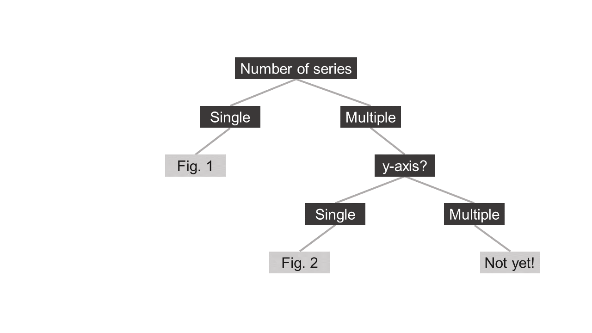

```{r setup, include=FALSE}
knitr::opts_chunk$set(echo = TRUE)
```

## Introduction

### Why R?
The main argument for using code to create RoM figures is to standardize figures across species and to do so while limiting repetive work (you only need to write a script once!). These figures here are made with the package ggplot2, which is a very powerful tool for making multilevel figures and allows for easy modification via the theme-function. 

### Basic prerequisitis
It is an advantage if you know some Basic R. I strongly recommend using R-studio and working in a so called R-studio project. When you open R, click File/New Project/New Directory and specify where you want to save it. Open the "your_project_name".Rproj and click File/New Script and save that in your project folder. And that's it! The best thing is that now all your search paths are relative and not absolute. If you want to read in data, put the data inside the project folder and you don't have to specify the full search path ("C:/R/RoM/data-file.csv"), it's enought you give the name of the file only (more on that below!). Another benefit with a relative search path is that I don't have to worry about setting the working directory and changing the directory each time I try to rerun anyone elses script. 

Lastly, this is an R Markdown document. This means R-code is text with grey background. You can copy these chunks of code to a new R-script in your R-studio project.

### What does this script do?
This script gives an example of how you can use R to create standardize figures in R, and save them in a standardized resolution as a .tiff, ready to be used without further editing.

I have chosen data for pike (*Esox lucious*) as an example, because it has all potential data for a RoM species (recreational, multiple areas, error bars etc.). These data have been uploaded on github: https://github.com/maxlindmark/ROM

### How do I use this for my species?
Most basic RoM figures that all species have in some form can be grouped into three different categories. Each category will have its own script. Once you identify the best category for your species you **should not have to modify the actual plotting code**, instead the aim to is to only pre-define you vaiables. Do not worry! Instructions for how to do that will be in the described below! The categories are:

+ Fig. 1. Single series
+ Fig. 2. Multiple series
+ Fig. 3. Multiple series and y-axes - ***not yet implemented, see end of document!***

Check out the flowchart below to help identify which plot you need. 



Once you identify which plot type you will use, you can read about how to prepare your data to use the script. A standardized way of saving data is key for making any kind of standardized script! The data structure is described in section **Preparation**.

This is a first draft and a work in progress so any feedback on this document or the figures are highly appreciated!

## Preparation
### Load libraries
Before starting, we need to install a few packages:
```{r message=FALSE, warning=FALSE}
rm(list = ls()) # clear the workspace from objects

# Provide package names
pkgs <- c("devtools", "ggplot2", "RCurl", "RCurl", "tidyr", "dplyr", "scales", "png", "knitr")

# Install packages
#install.packages(pkgs) # remove the hashtag if don't have them installed

# Load all packages
invisible(lapply(pkgs, function(x) require(x, character.only = T, quietly = T)))
```

### Load example data and clean it up!
Now let's read in the example data (freshwater pike):
```{r}
# Go to https://github.com/maxlindmark/ROM to view the data in the browser
dat <- read.csv(
  text = getURL("https://raw.githubusercontent.com/maxlindmark/ROM/master/pike.csv"), 
  sep = ";")
```

For your own species, the code would typically look like this if you put the data inside your R Project folder:
```{r, eval=FALSE}
dat <- read.csv("pike.csv", sep = ";")
```

Inspect the data:
```{r}
head(dat)
```

Users will have different encoding which affects how certain characters are read. Instead of forcing everyone to use the same encoding, I'm showing you how to rename columns. It is **very** important that you use these column names because they will determine which level gets which colour and line (if you insist on other column names you have to modify the plot code)!
```{r}
dat <- dat %>% rename(Område = Omr.e5.de,
                      År     = X.c5.r)
head(dat)
```

Columns look better! But we also need to modify the actual levels of the column (i.e. the levels of the lakes). You can see which lakes are in the data by typing: 
```{r}
levels(dat$Område)
```

Clearly we also need to correct the names of the levels, similar to how we did for column names. This is because the beauty of ggplot is that all important information in the plot will be inherited from the data.
```{r}
levels(dat$Område) <- c("Fritidsfiske", 
                        "Hjälmaren", 
                        "Mälaren", 
                        "Stora sjöarna", 
                        "Vänern", 
                        "Vättern")
head(dat)
```

There is one last thing you might need to do with the data before proceeding with plotting, and that is to change the order of the levels in the data. When plotting, ggplot sets the levels of the data in alphabetical order, but here we want a specific order: the first "level" should correspond to the total and the last to any special level, such as the recreational data.
```{r}
dat$Område <- factor(dat$Område,
                     levels = c("Stora sjöarna", 
                                "Vänern", 
                                "Vättern", 
                                "Mälaren", 
                                "Hjälmaren", 
                                "Fritidsfiske"))
```

Now the data look much better! You might not need to do these modification on your own data. **But you need** to make sure it is strutured in the same way, that is:

+ 1 row = 1 observation (not multiple columns for different areas)
+ first level (see last code chunk) corresponds to total biomass and last one is special series

### Define ggplot theme 
Now that you have loaded and cleaned up your or the example data, we can move on with general plotting settings. First the color palette:
```{r}
pal <- c("#56B4E9", "#009E73", "#F0E442", "#0072B2", "#E69F00", "#D55E00")
```

Second, we define the theme we will use for all plots. This is made to match as closely as possible to the RoM style. This applies to all figures styles. In the future this function should be sourced but here I show it in full. Make sure you copy paste this function and run it. 
```{r}
theme_rom <- function(base_size = 12, base_family = "") {
  theme_bw(base_size = 12, base_family = "") +
    theme(
      axis.text = element_text(size = 8), 
      axis.title = element_text(size = 8),
      axis.ticks.length = unit(0.05, "cm"),
      axis.line = element_line(colour = "black",
                               size = 0.3), 
      text = element_text(family = "sans"),
      panel.grid.major = element_blank(),
      panel.grid.minor = element_blank(),
      panel.border = element_blank(),
      plot.title = element_text(hjust = 0.5, 
                                margin = margin(b = -3), 
                                size = 9.6, 
                                face = "bold"),
      legend.position = c(0.5, -0.25),
      legend.text = element_text(size = 8),
      legend.justification = "bottom", 
      legend.background = element_rect(fill = "transparent"), 
      legend.key = element_rect(fill = "transparent"),
      aspect.ratio = 1,
      plot.margin = unit(c(5.5, 5.5, 20, 5.5), 
                         "points")
      )
}
```

## Let's start making figures!
## Fig. 1. Single series
```{r, fig.width=3.14961, fig.height=3.14961, echo=FALSE, fig.align='center', fig.cap='Siklöja in Mälaren (RoM 2018) - example of a single-series plot'}
sikloja_path <- "sikloja.png"
include_graphics(sikloja_path)
```

For illustration purposes, we will now pretend our example pike dataset only is a single series, by filtering it to only contain the area "Stora Sjöarna". If you have Fig.1 situation, your data might look something like this, with one column for year, one for area and one for tonnes.
```{r, message=FALSE, warning=FALSE}
 dat1 <- dat %>% 
  select(År, Ton, Område) %>% 
  filter(Område == "Stora sjöarna")
```

We now need to specify y-axis titles and plot title. **This is what is meant by predifing variables! Instead of changing the plotting code we define what we want it to plot on the axis, for instance**. For the pike data we can set them as:
```{r}
y_axis <- c("Landningar (ton)")
title  <- c("Landningar")
```

Now go ahead and create the plot
```{r, message=FALSE, warning=FALSE}
p1 <- ggplot(dat1, aes(År, Ton)) +
  geom_bar(data = dat1, 
           aes(x = År, y = Ton), stat = "identity", color = pal[1], fill = pal[1], 
           width = 0.6) +
  #scale_color_manual(values = pal) +
  scale_alpha_manual(values = c(1, 1, 1, 1, 1, 0)) +
  labs(x = "", y = y_axis) + # here's where the axis title is called
  ggtitle(title) +           # here's where the title is called
  guides(color  = FALSE) +
  scale_x_continuous(expand = c(0, 0), breaks = scales::pretty_breaks(n = 6)) +
  scale_y_continuous(expand = c(0, 0), breaks = scales::pretty_breaks(n = 5)) +
  theme_rom()
```

```{r, fig.width = 3.14961, fig.height = 3.14961, echo = FALSE, fig.align='center', fig.cap='Gädda in the "Great Lakes" (RoM 2018) - example of a single-series plot using R'}
p1
```

Save the file (to your working directory)
```{r, message=FALSE, warning=FALSE, results="hide"}
ggsave("Fig_1.tiff", plot = p1, dpi = 300, width = 8, height = 8, units = "cm")
```


## Fig. 2. Multiple series
```{r, fig.width=3.14961, fig.height=3.14961, echo=FALSE, fig.align='center', fig.cap='Gädda in the "Great Lakes" (RoM 2018) - example of a multiple-series plot'}
gadda_path <- "gadda.png"
include_graphics(gadda_path)
```

We now need to specify y-axis titles and plot title, and in addition we need to define how mnay levels we have! For the pike data we can set them as:
```{r}
y_axis <- c("Landningar (ton)")
title <- c("Landningar") 
main_series <- c("Stora sjöarna")
n_lev <- length(unique(dat$Område)) 
special_series <- c("Fritidsfiske")
```

Note that we in this example use multiple data series, and that one of them is is recreational fisheries that in turn has error bars. **These need to be in columns, so that we have a high (rec_plus) and a low (rec_minu) column. Note also that they are NA when the Område is not equal to recreational fisheries**
```{r}
head(dat) 
tail(dat)
```


```{r, message=FALSE, warning=FALSE}
p2 <- ggplot(dat, aes(År, Ton, color = Område)) +
  geom_bar(data = subset(dat, Område == main_series), 
           aes(x = År, y = Ton), stat = "identity", color = pal[1], fill = pal[1], 
           width = 0.6) +
  geom_line(data = dat, aes(År, Ton, color = Område, alpha = Område), 
            size = 1) + 
  geom_point(data = subset(dat, Område == special_series), # here we define our special series
             aes(År, Ton, fill = Område), size = 2, color = pal[max(n_lev)]) + 
  # above the number of level enters (max(n_lev))
  geom_errorbar(data = subset(dat, Område == special_series), 
                aes(x = År, ymin = rec_minu, ymax = rec_plus), 
                show.legend = FALSE, width  = 1, color = pal[max(n_lev)]) +
  scale_color_manual(values = pal[seq(1, n_lev)]) +
  scale_alpha_manual(values = c(rep(1, (n_lev-1)), 0)) + 
  # above we set the line between rec fisheries transparent
  labs(x = "", y = y_axis) +
  ggtitle(title) +
  guides(fill  = FALSE,
         alpha = FALSE,
         color = guide_legend(nrow = 3, 
                              title = "",
                              override.aes = list(size = 1.3, 
                                                  color = pal[seq(1, n_lev)]),
                              keywidth = 0.3,
                              keyheight = 0.1,
                              default.unit = "inch")) +
  scale_x_continuous(expand = c(0, 0), breaks = scales::pretty_breaks(n = 6)) +
  scale_y_continuous(expand = c(0, 0), breaks = scales::pretty_breaks(n = 5)) +
  theme_rom()
```

```{r, fig.width=3.14961,fig.heigh=3.14961,echo=FALSE,fig.align='center',warning=FALSE,fig.cap='Gädda in the Great Lakes (RoM 2018) - example of a multiple-series plot using R'}
p2
```

Now save the file (to your working directory)
```{r, message=FALSE,warning=FALSE,results="hide",eval=FALSE}
ggsave("Fig_2.tiff", plot = p2, dpi = 300, width = 8, height = 8, units = "cm")
```

Let's say that you have 3 different areas and no special series and no error bars. Then you simply need to hashtag the code the plots those features. We subset the full data as an example:
```{r}
dat2 <- dat %>% 
  select(År, Ton, Område) %>% 
  filter(Område %in% c("Stora sjöarna", "Mälaren"))
```

We now need to update the number of levels in the data:
```{r}
n_lev <- length(unique(dat2$Område)) 
```

Repeat the general Fig. 2 plot, but remove the points and errorbars:
```{r, message=FALSE, warning=FALSE}
p2a <- ggplot(dat2, aes(År, Ton, color = Område)) +
  geom_bar(data = subset(dat2, Område == main_series), 
           aes(x = År, y = Ton), stat = "identity", color = pal[1], fill = pal[1], 
           width = 0.6) +
  geom_line(data = dat2, aes(År, Ton, color = Område, alpha = Område), 
            size = 1) + 
  #geom_point(data = subset(dat, Område == special_series), # here we define our special series
  #           aes(År, Ton, fill = Område), size = 2, color = pal[max(n_lev)]) + 
  #geom_errorbar(data = subset(dat, Område == special_series), 
  #              aes(x = År, ymin = rec_minu, ymax = rec_plus), 
  #              show.legend = FALSE, width  = 1, color = pal[max(n_lev)]) +
  scale_color_manual(values = pal[seq(1, n_lev)]) +
  #scale_alpha_manual(values = c(rep(1, (n_lev-1)), 0)) + 
  labs(x = "", y = y_axis) +
  ggtitle(title) +
  guides(fill  = FALSE,
         alpha = FALSE,
         color = guide_legend(nrow = 3, 
                              title = "",
                              override.aes = list(size = 1.3, 
                                                  color = pal[seq(1, n_lev)]),
                              keywidth = 0.3,
                              keyheight = 0.1,
                              default.unit = "inch")) +
  scale_x_continuous(expand = c(0, 0), breaks = scales::pretty_breaks(n = 6)) +
  scale_y_continuous(expand = c(0, 0), breaks = scales::pretty_breaks(n = 5)) +
  theme_rom()
```

```{r, fig.width=3.14961,fig.heigh=3.14961,echo=FALSE,fig.align='center',warning=FALSE,fig.cap='Gädda in the Great Lakes (RoM 2018) - example of a multiple-series plot using R'}
p2a
```

### To work on:

+ secondary y-axis that is not a one-to-one transformation of the primary axes. Possible?

+ set Ton in column name as biomass and define ton as a vector!
+ name chunks
+ write comments in pdf: what about aspect ratio?


